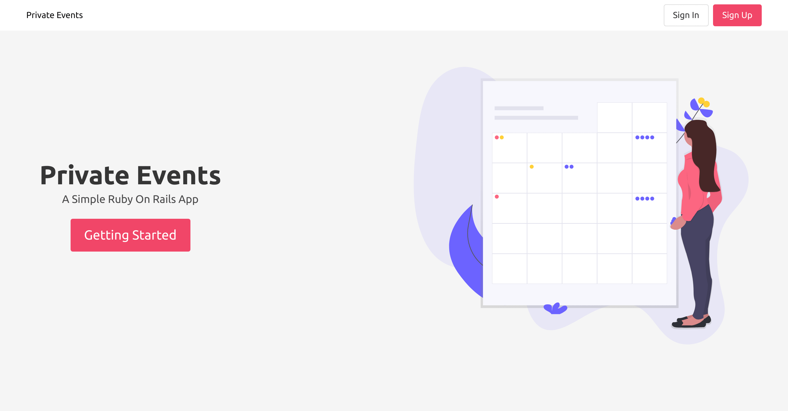

# Re-Former

A site similar to a private Eventbrite which allows users to create events and then manage user signups. Events take place at a specific date and at a location

## Built With

- Ruby,
- Ruby On Rails,
- Html/Css

## Getting Started

To get a local copy up and running follow these simple example steps.
- git clone git@github.com:genzaraki/private-events/.git

Then you browse to the folder and exucute the following commands
- cd re-former
- bundle install

Thus run the migration
- rails db:migrate

Now, you can open the app in your text editor to check out the forms created and run 'rails s' to test the app.

## Author

👤 **Amadou IBRAHIM**

- Github: [@genzaraki](https://github.com/genzaraki)
- Twitter: [@tigamadou](https://twitter.com/tigamadou)
- Linkedin: [Amadou IBRAHIM](https://www.linkedin.com/in/amadou-ibrahim-75769167/)

## 🤝 Contributing

Contributions, issues and feature requests are welcome!

Feel free to check the [issues page](issues/).

## Show your support

Give a ⭐️ if you like this project!

## Acknowledgments

- [Microverse](https://microverse.org)
- [The Oddin Project](https://www.theodinproject.com/courses/ruby-on-rails/lessons/associations)

## 📝 License

This project is [MIT](lic.url) licensed.
